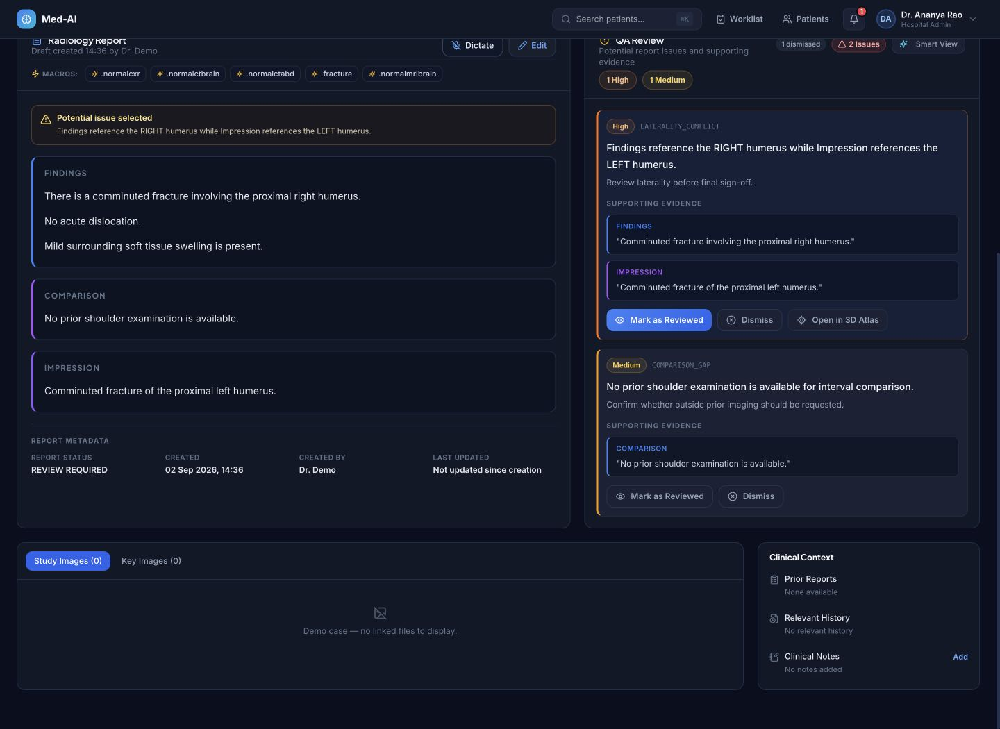
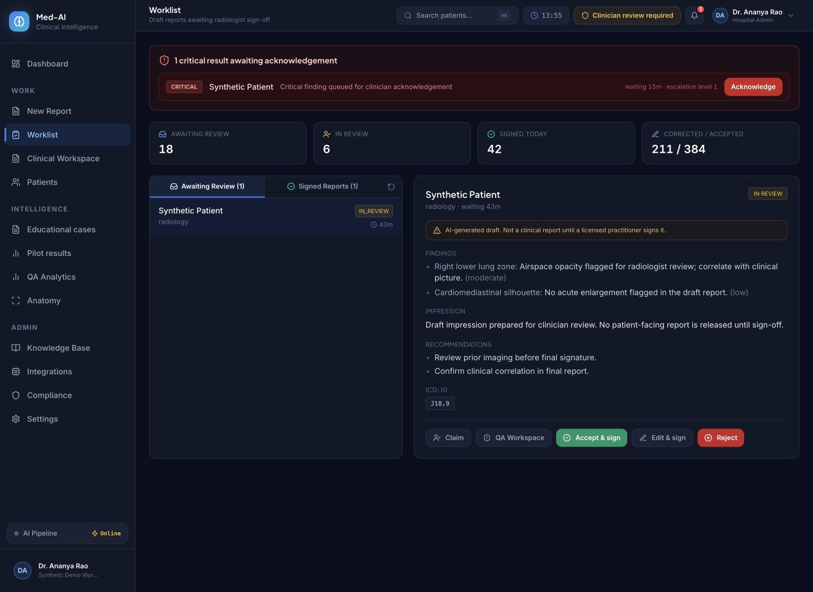
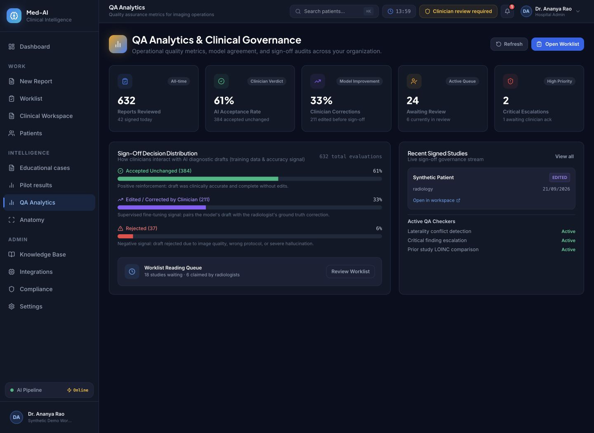
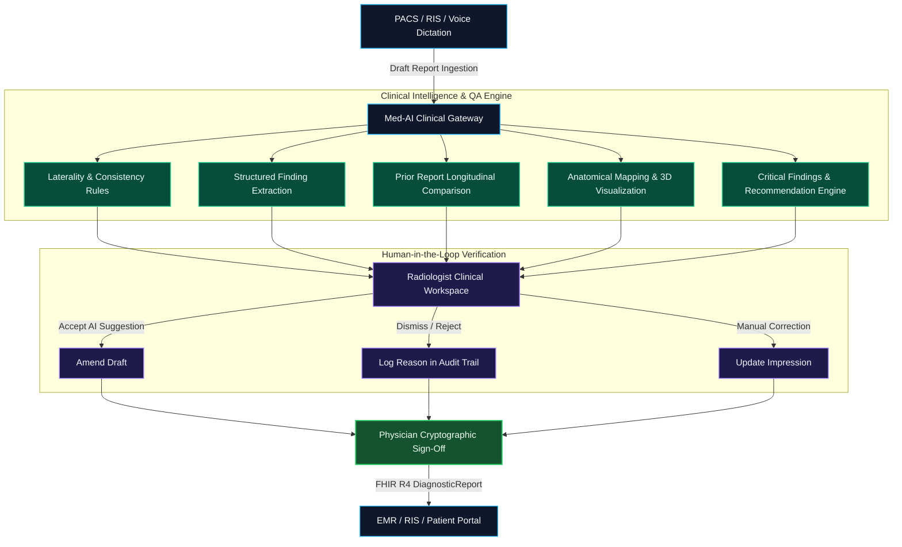

<div align="center">

# 🩺 Med-AI Clinical Intelligence

**Enterprise Clinical Quality Assurance & Decision-Support Infrastructure for Radiology Teams**

*AI drafts and validates. Licensed clinicians review, verify, and sign.*

[](https://github.com/manojrayat1992/med-ai-assitant/actions/workflows/ci-cd.yml)
[](https://openjdk.org/projects/jdk/21/)
[](https://spring.io/projects/spring-boot)
[](https://react.dev)
[](https://www.typescriptlang.org/)
[](https://github.com/pgvector/pgvector)
[](#standards--compliance)
[](#license)

[🌐 Marketing & Documentation](https://medaiclinical.com) &nbsp;•&nbsp; [🏥 Clinical Application](https://app.medaiclinical.com) &nbsp;•&nbsp; [📖 Architectural Guides](#architecture--documentation)

---

</div>

## 📌 Executive Summary

**Med-AI Clinical** is an enterprise clinical intelligence and quality-assurance (QA) layer designed specifically for diagnostic imaging centers, radiology groups, and teleradiology networks.

Rather than attempting autonomous diagnosis, Med-AI acts as a **second pair of eyes** directly inside the radiologist’s reporting workflow:
- **Catches discrepancies** (e.g., laterality mismatches, missing recommendations, critical unaddressed findings) *before* signature.
- **Performs longitudinal comparison** against prior imaging reports to track progression or resolution over time.
- **Maps free-text clinical findings** to standardized anatomical structures and ontological codes.
- **Guarantees human-in-the-loop integrity** with non-repudiable audit logs and physician sign-off workflows.

---

## 📸 Product Interface

<div align="center">

### 1. Clinical Review Workspace
*Interactive report drafting, automated finding extraction, real-time QA alerts, and anatomical context.*
<br/>


<br/><br/>

### 2. Reading Room Worklist & Triage
*Multi-tenant queue with urgency indicators, critical finding alerts, and review statuses.*
<br/>


<br/><br/>

### 3. QA Analytics & Audit Dashboard
*Action acceptance rates, physician dismissal analytics, critical escalation tracking, and turn-around time metrics.*
<br/>


</div>

---

## 🔄 Clinical Workflow



---

## ⚡ Core Capabilities

### 1. 🛡️ Report Quality Assurance Engine
* **Laterality Discrepancy Detection**: Identifies conflicts between findings (e.g., "right apical nodule" in findings vs "left" in impression).
* **Missing Recommendation Tracking**: Flags critical or indeterminate findings where guideline-recommended follow-up intervals are omitted.
* **Terminology Standardization**: Maps free-text findings to standardized RadLex, SNOMED-CT, and LOINC codes.

### 2. 🧠 Multi-Tenant AI Orchestration
* **Dynamic Provider Switching**: Seamless orchestration across Anthropic Claude, OpenAI, and local LLM instances (Ollama / HuggingFace).
* **Per-Tenant Configuration**: Allows hospitals and diagnostic chains to configure provider API keys, fallbacks, and temperature settings at the tenant level.
* **Audit & Token Accounting**: Granular token usage tracking and latency metrics per request.

### 3. 🦴 Anatomy Mapping & Visualization
* **Structured Spatial Mapping**: Automatically tags identified abnormalities to canonical anatomical regions.
* **Interactive 3D Views**: Integrates Three.js anatomical visualizations for orientation and patient-facing educational reports.

### 4. 📈 Longitudinal Finding Comparison
* **Historical Prior Analysis**: Automatically retrieves previous imaging reports for the patient across the RIS.
* **Temporal Trend Tracking**: Highlights interval changes (size increase, reduction, new lesions, stable findings) across serial scans.

### 5. 🔒 Security, Compliance & Data Residency
* **Data Residency**: Deployed in AWS Mumbai (`ap-south-1`) to strictly comply with India's **Digital Personal Data Protection (DPDP) Act**.
* **Zero PHI Leaks**: Ephemeral AI inference without model retraining on patient data.
* **RBAC & OIDC**: Fine-grained role-based access control, tenant isolation, and cryptographic audit logs.

---

## 🏛️ System Architecture

```
med-ai-assistant/
├── backend/                       # Spring Boot 3.3 (Java 21) REST & WebSocket API
│   ├── src/main/java/com/medai/
│   │   ├── analysis/             # AI orchestration & finding extraction
│   │   ├── anatomy/              # 3D anatomy mapping & spatial coordinates
│   │   ├── qa/                   # Report QA rules engine (Laterality, consistency)
│   │   ├── longitudinal/         # Prior report comparison & interval analysis
│   │   ├── report/               # Clinical reporting & workflow lifecycle
│   │   ├── tenant/               # Multi-tenant config & custom provider settings
│   │   └── security/             # DPDP / HIPAA compliance, JWT & RBAC
│   └── pom.xml
├── frontend/                      # React 19 + TypeScript + Vite SPA
│   ├── src/
│   │   ├── pages/                # Worklist, Clinical Workspace, Analytics, Anatomy
│   │   ├── components/           # Theme-aware, accessible clinical UI components
│   │   ├── services/             # Axios API clients & WebSocket handlers
│   │   └── stores/               # Zustand state stores (Theme, Auth, Case)
│   └── package.json
├── marketing/                     # Static marketing site (Cloudflare Workers Assets)
│   ├── index.html, product.html, pricing.html, security.html, validation.html
│   └── styles.css
├── docker/                        # Production multi-stage Dockerfiles
├── helm/                          # Kubernetes Helm charts for EKS deployment
└── wrangler.jsonc                 # Cloudflare Workers configuration for marketing site
```

---

## 💻 Tech Stack

| Domain | Technologies |
| :--- | :--- |
| **Backend Engine** | Java 21, Spring Boot 3.3, Spring Security, Spring Data JPA, Flyway |
| **Database & Vector**| PostgreSQL 16, pgvector (semantic embedding similarity), Redis |
| **Frontend App** | React 19, TypeScript, Vite, Vanilla CSS & Dynamic Design Tokens, Zustand |
| **Visualization** | Three.js (interactive anatomy), Chart.js / Recharts |
| **Clinical Interop** | FHIR R4, DICOM SR, ABDM (Ayushman Bharat Digital Mission) |
| **Cloud & DevOps** | Docker, Kubernetes (AWS EKS), AWS ECR, Cloudflare Workers, GitHub Actions |

---

## 🚀 Getting Started

### Prerequisites
- **Java 21** (Temurin / OpenJDK)
- **Node.js 20+** and `npm`
- **Docker** & **Docker Compose**
- **PostgreSQL 16** with `pgvector` extension

### 1. Clone the Repository
```bash
git clone git@github.com:manojrayat1992/med-ai-assitant.git
cd med-ai-assitant
```

### 2. Environment Configuration
Copy the example environment file and update your credentials:
```bash
cp .env.example .env
```

### 3. Run with Docker Compose (Fastest)
```bash
docker compose up -d postgres redis
```

### 4. Run Backend Locally
```bash
cd backend
mvn clean install -DskipTests
mvn spring-boot:run
```
*Backend API boots on `http://localhost:8080` (Swagger UI at `/swagger-ui.html`).*

### 5. Run Frontend Locally
```bash
cd frontend
npm install
npm run dev
```
*Clinical app boots on `http://localhost:5173`.*

---

## ⚠️ Regulatory & Scope Transparency

To maintain regulatory integrity (CDSCO & US FDA 21 CFR Part 820):

| ❌ What Med-AI is **NOT** | ✅ What Med-AI **IS** |
| :--- | :--- |
| 🚫 An autonomous diagnostic AI | 🛡️ A clinical QA and consistency reviewer |
| 🚫 An autonomous image classifier | 📄 A natural language report intelligence assistant |
| 🚫 A prescription or treatment generator | 🔍 An anomaly flagger for physician attention |
| 🚫 A replacement for PACS or RIS | 🔌 An interoperable decision-support plugin |

> **Clinical Disclaimer:** Med-AI outputs are decision-support suggestions intended exclusively for licensed radiologists and healthcare professionals. Every report amendment and sign-off requires independent physician verification.

---

## 📖 Architecture & Documentation

- [AWS Production Deployment Guide](docs/DEPLOYMENT-AWS.md)
- [Low-Cost / Startup Hosting Architecture](docs/DEPLOYMENT-CHEAP.md)
- [Cloudflare Marketing Site Configuration](docs/MARKETING-SITE.md)
- [3D Anatomy Visualization Specifications](docs/ANATOMY-3D-ASSET.md)

---

## 📄 License

Proprietary & Confidential. All rights reserved. &copy; Med-AI Clinical Intelligence.
